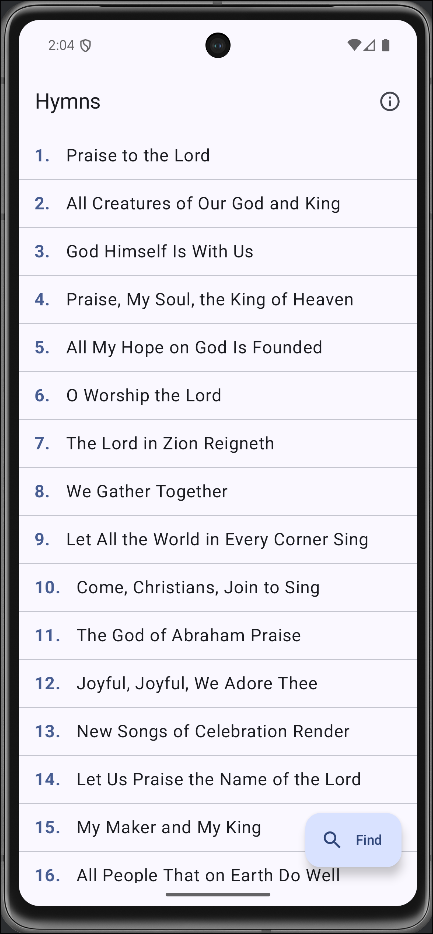

# SDAH - An Open Source Hymnal App

A simple, offline-first open source hymnal application for Android.




## Tech Stack
*   **Jetpack Compose:** The UI is built entirely with Jetpack Compose for a modern, declarative approach.
*   **MVVM Architecture:** Follows the Model-View-ViewModel pattern for a clean separation of concerns.
*   **Material 3:** Implements the latest Material Design guidelines for a clean, modern look.

## Getting Started

### Installation
See pre-release apks.

### Manual installation

To build and run the project locally, you will need:

1.  Android Studio Hedgehog (2023.1.1) or newer.
2.  Clone the repository:
    ```bash
    git clone https://github.com/MosetiObadiah/SDAH.git
    ```
3.  Open the project in Android Studio.
4.  Let Gradle sync the dependencies.
5.  Run the app on an emulator or a physical device.

## Contributing

Contributions are welcome! If you find a bug or if you have a feature request, or want to improve the code, please feel free to:

1.  Open an issue to discuss the change.
2.  Fork the repository, create a new branch, and submit a pull request.
