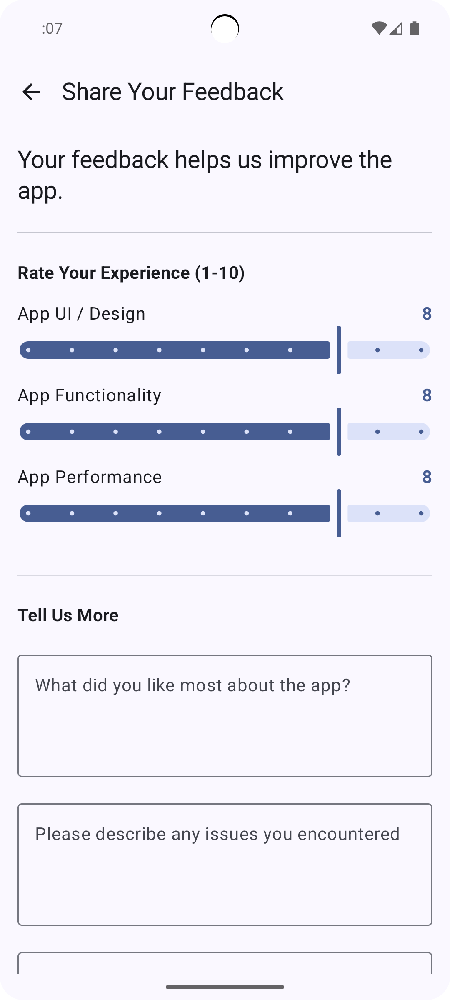

# SDAH - An Open Source Hymnal App

A simple, modern, offline-first hymnal application for Android, built for speed and ease of use.

<p align="center">
  <table>
    <tr>
      <td align="center">
        <br/>
        <b>Hymn List</b>
      </td>
      <td align="center">
        <br/>
        <b>Advanced Search</b>
      </td>
      <td align="center">
        <br/>
        <b>Hymn Details</b>
      </td>
      <td align="center">
        <br/>
        <b>Reader Controls</b>
      </td>
      <td align="center">
        <br/>
        <b>Feedback Form</b>
      </td>
    </tr>
  </table>
</p>

## Features

*   **Complete Offline Access:** All hymns are stored locally.
*   **Fast Advanced Search:** Instantly find any hymn by its title or lyrics.
*   **Quick Find by Number:** A dedicated number pad lets you jump directly to any hymn by its number.
*   **Customizable Reading Experience:** Adjust the font size and style (Serif, Sans Serif, etc.) for maximum comfort.
*   **Seamless Navigation:** A smooth, performant list of all hymns and an intuitive swipe interface to move between hymns in the detail view.
*   **Favorites & Playlists (Coming Soon):** Bookmark your favorite hymns and create custom lists for services and events.

## Tech Stack & Architecture

This project serves as a showcase of modern Android development techniques, with a strong focus on performance and clean architecture.

*   **Kotlin & Jetpack Compose:** The UI is built entirely with Jetpack Compose for a modern, declarative, and reactive approach.
*   **MVVM Architecture:** Follows the Model-View-ViewModel pattern for a clean separation of concerns and a testable codebase.
*   **Kotlin Coroutines & Flow:** Used for all asynchronous operations, from loading data to powering the debounced search feature.
*   **Advanced Search Indexing:** On startup, the app builds an in-memory inverted index of all hymn content.
*   **Material 3:** Implements the latest Material Design guidelines for a clean, modern look.

## Getting Started

### Installation
You can find pre-release APKs on the [Releases page](https://github.com/MosetiObadiah/SDAH/releases).

### Building from Source

To build and run the project locally, you will need:

1.  Android Studio Iguana (2023.2.1) or newer.
2.  Clone the repository:
    ```bash
    git clone https://github.com/MosetiObadiah/SDAH.git
    ```
3.  Open the project in Android Studio.
4.  Let Gradle sync the dependencies.
5.  Run the app on an emulator or a physical device.

## Contributing

Contributions are welcome. If you find a bug, have a feature request, or want to improve the code, please feel free to:

1.  [Open an issue](https://github.com/MosetiObadiah/SDAH/issues) to discuss the change.
2.  Fork the repository, create a new branch, and submit a pull request.